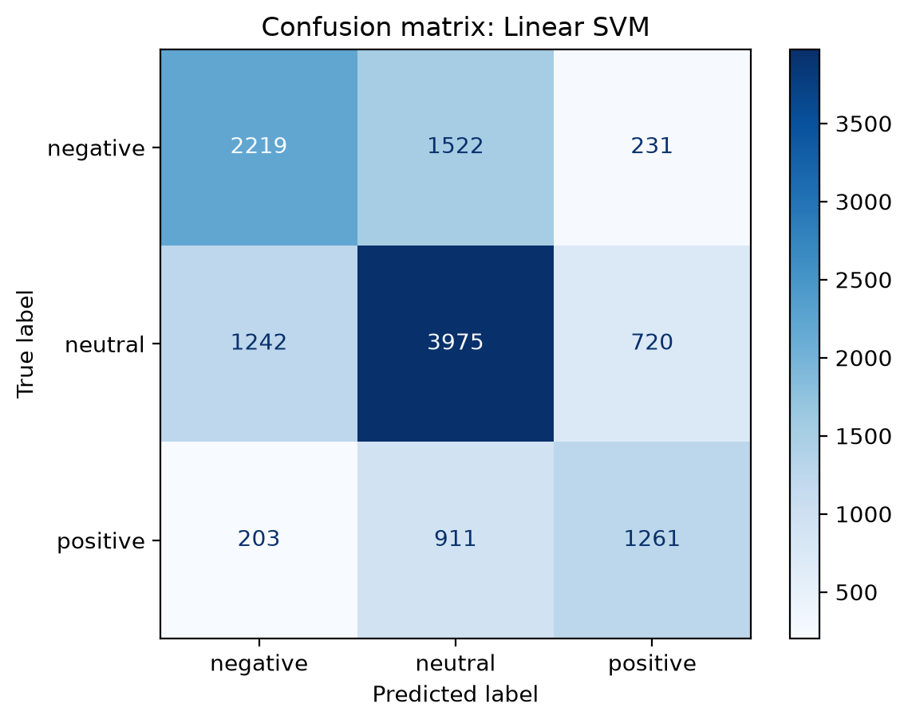

# Multi-Class Sentiment Classifier (NLP)

Classifies short English texts (tweets) as **negative**, **neutral** or **positive** using classic NLP:
stop-word removal, lemmatization, TF-IDF features and Scikit-Learn models.
Built as Task 2 of the Progree Remote Internship in Artificial Intelligence.

## Results

Test set: 12,284 tweets from the [TweetEval sentiment](https://github.com/cardiffnlp/tweeteval) benchmark.

| Model | Accuracy | Macro-F1 |
|---|---|---|
| Multinomial Naive Bayes | 0.563 | 0.534 |
| Logistic Regression | 0.593 | 0.587 |
| **Linear SVM** | **0.607** | **0.592** |

| Class (Linear SVM) | Precision | Recall | F1 |
|---|---|---|---|
| Negative | 0.606 | 0.559 | 0.581 |
| Neutral | 0.620 | 0.670 | 0.644 |
| Positive | 0.570 | 0.531 | 0.550 |



Most errors involve the neutral class; the model rarely confuses negative with positive.
The full write-up is in [report/Task2_Sentiment_Classifier_Report.pdf](report/Task2_Sentiment_Classifier_Report.pdf).

## Pipeline

1. **Load data**: TweetEval train (45,615 tweets) and test (12,284 tweets) splits.
2. **Preprocess**: lowercase, replace links and @mentions, remove NLTK stop-words (keeping negations such as *not* and *never*), WordNet lemmatization.
3. **Features**: TF-IDF with unigrams and bigrams (63,492 features).
4. **Models**: Naive Bayes, Logistic Regression and Linear SVM (balanced class weights).
5. **Evaluation**: accuracy, per-class and macro F1, confusion matrix.

## How to run

**Google Colab:** open `sentiment_classifier.ipynb` and run all cells.

**Locally:**

```bash
pip install -r requirements.txt
python sentiment_classifier.py
```

The dataset is downloaded automatically from the TweetEval GitHub repository.

## Project structure

```
sentiment_classifier.ipynb   notebook version (step by step)
sentiment_classifier.py      same code as a script
results/                     charts (confusion matrix, F1 comparison, class distribution)
report/                      full PDF report
```

## Author

Darakhshan Mujtaba, Progree AI Internship (2026)
